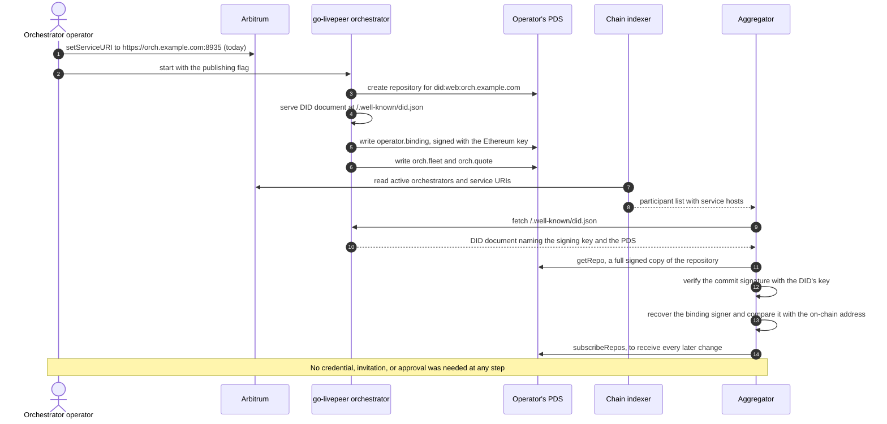
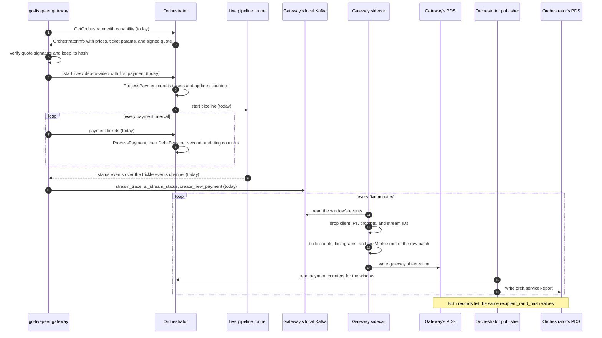
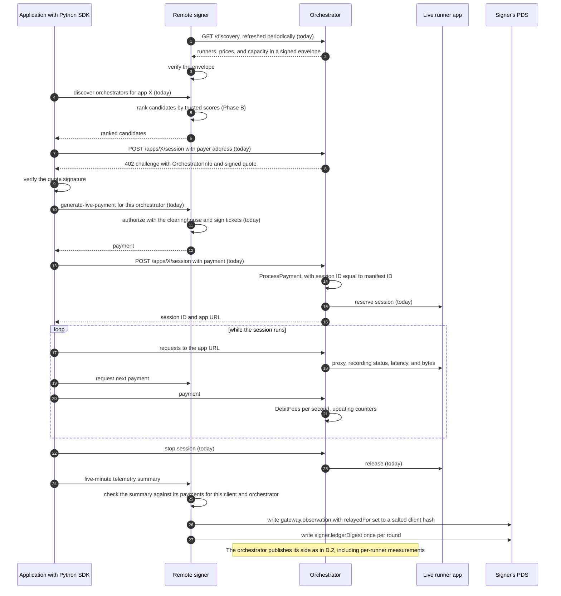
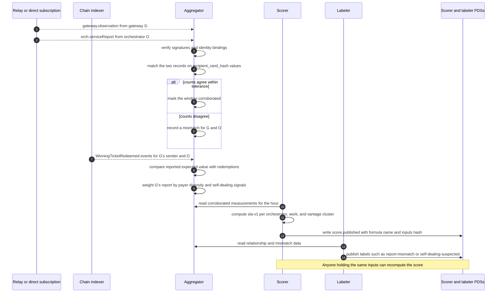
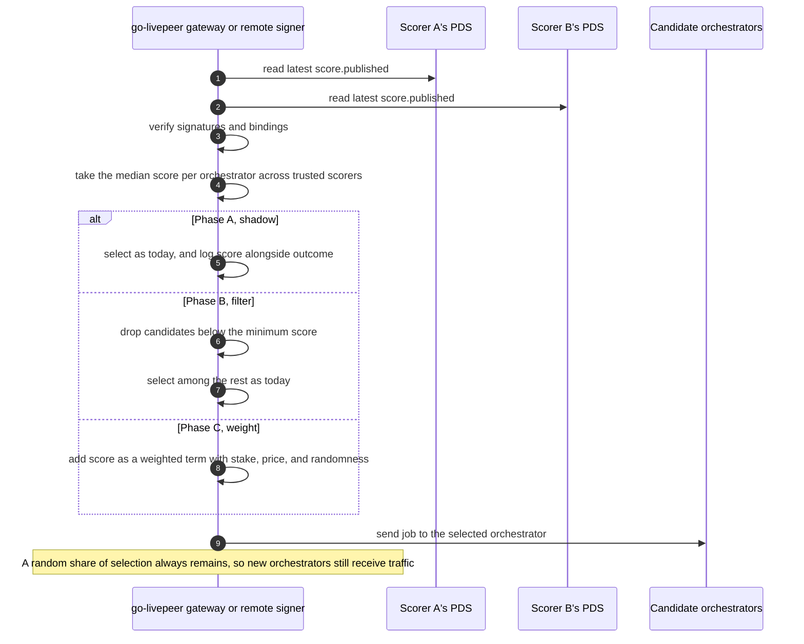
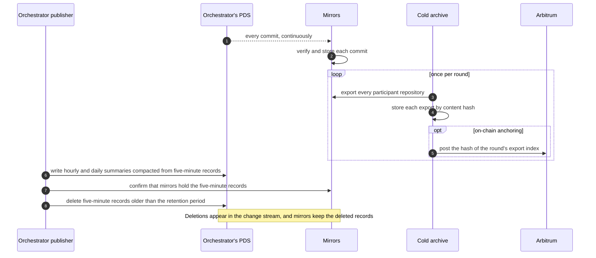
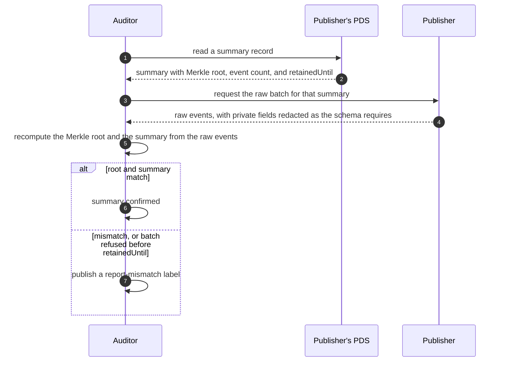

# Appendix D: Sequence diagrams

*Companion to [Operator-Owned Telemetry for the Livepeer Network](README.md). Each diagram traces one flow from the proposal step by step. Steps marked "today" already happen in go-livepeer; everything else is proposed.*

Record type names refer to the schemas in [Appendix A](appendix-a-record-schemas.md). Code changes refer to [Appendix B](appendix-b-change-list.md).

## D.1 An operator joins

An orchestrator becomes visible to every aggregator without asking anyone. The chain already lists it; its repository proves that the repository and the on-chain address belong to the same operator.

A remote signer joins the same way, except that its participant status comes from its TicketBroker deposit rather than from bonding, and it may also publish `operator.delegation` records naming the gateways it pays for.

## D.2 A live video-to-video session

A go-livepeer gateway runs a live video-to-video stream on an orchestrator. Both sides end up publishing a five-minute summary of the same session, and both summaries carry the same `recipient_rand_hash` values, which is what lets an aggregator match them later.

The gateway needs no code change in Phase A: the sidecar reads events go-livepeer already sends to Kafka. The orchestrator needs the counters in [§B.1.1](appendix-b-change-list.md#b11-cumulative-accounting-counters--phase-a-standalone) and the publisher in [§B.1.6](appendix-b-change-list.md#b16-embedded-publisher--phase-a).

## D.3 A Live Runner session

An application using the Python SDK runs a persistent Live Runner session, paying through a remote signer. The application holds no key and publishes nothing itself. Its signer checks the application's telemetry against its own payment records and publishes it.

## D.4 Corroboration and scoring

An aggregator receives both sides of a session, matches them, checks payment on-chain, and weighs the reporter. A scorer then turns corroborated measurements into a published score that anyone can recompute.

## D.5 Scores in selection

Gateways and signers each choose which scorers to trust. How they use the scores depends on the phase.

For go-livepeer gateways, this replaces the single `-orchPerfStatsUrl` source. For Live Runner, the remote signer applies it inside its discovery endpoint, as step 5 of D.3 shows.

## D.6 Preserving history

Operators may prune detailed records once independent mirrors hold them. Mirrors keep deleted records, so pruning cannot erase history.

## D.7 Auditing a summary

Any summary can be checked against the raw events it was computed from, for as long as the publisher's stated retention period lasts.

One design question remains open here: raw events contain the private fields that summaries omit, so the specification must define how a publisher redacts a batch while keeping the Merkle root verifiable. The simplest approach is to compute the root over already-redacted events.
