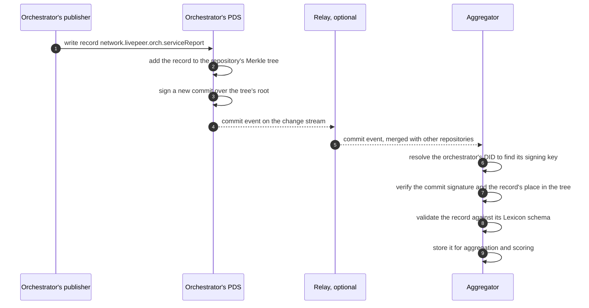

# AT Protocol Primer for Livepeer Operators

*Companion to [Operator-Owned Telemetry for the Livepeer Network](README.md). This primer explains the parts of AT Protocol the proposal relies on, for readers who know Livepeer but not AT Protocol. It does not cover the social features of Bluesky, which the proposal does not use.*

---

## 1. The idea in one paragraph

AT Protocol lets each account publish signed records into a repository it controls, and lets anyone collect those records without asking permission. The protocol's own summary is: *"Users publish JSON records into repositories. The changestreams of those records then sync across the network to drive applications."* Bluesky uses it for social posts. Nothing in the core protocol is specific to social media, and a growing number of applications use it for other kinds of data.

For Livepeer, an "account" is an operator, a "record" is a signed claim such as a five-minute service report, and an "application" is anything that reads those claims: an analytics dashboard, a scorer, or a gateway choosing an orchestrator.

## 2. Following one record

The easiest way to see how the parts fit is to follow one record from creation to use. Suppose an orchestrator publishes its service report for 14:00–14:05.



Four things happened that matter for Livepeer:

1. **The operator's own server stored the record.** Nobody else holds the authoritative copy.
2. **The record was signed as part of a commit.** Any later reader, including one who received it second-hand from a mirror, can verify that the orchestrator published exactly this record.
3. **The aggregator did not need permission.** The change stream is public by design; the protocol calls unauthenticated access to it "a core feature."
4. **The relay was a convenience.** The aggregator could have subscribed to the orchestrator's PDS directly, and at Livepeer's scale — hundreds of operators, not millions of accounts — it often will.

The sections below explain each part in turn.

## 3. The parts

### 3.1 Identity: DIDs

Every account is identified by a **decentralized identifier (DID)**. A DID resolves to a small JSON document that names three things: the account's current signing key, the server hosting its repository, and optionally a human-readable name. Changing the signing key means updating the DID document; the DID itself stays the same.

AT Protocol supports two DID methods:

| Method | How it resolves | Strength | Weakness |
|---|---|---|---|
| `did:plc` | Through a directory service, `plc.directory` | Supports key rotation and account recovery | The directory is a single service operated by Bluesky, currently being moved to an independent Swiss association |
| `did:web` | From `https://<hostname>/.well-known/did.json` | Depends on nothing but DNS and the operator's own web server | Tied to the domain name; losing the domain means losing the identity, with no recovery mechanism |

The proposal uses `did:web`, because each orchestrator already controls the hostname in its on-chain service URI. That choice keeps Livepeer independent of the one component of AT Protocol that critics most often identify as centralized. The cost is that an operator who changes its domain must establish a new identity.

Bluesky accounts also have **handles**, human-readable names such as `alice.example.com`. The proposal does not need them.

### 3.2 Repositories and records

Each account owns exactly one **repository**. A repository holds **records**, which are JSON documents grouped into **collections** named after their schema. Each record has a key within its collection, so every record has a global address of the form:

```
at://did:web:orch.example.com/network.livepeer.orch.serviceReport/3l4abc...
```

The repository is organized as a **Merkle search tree**: a tree in which every node is identified by the hash of its contents, so the hash at the root summarizes every record. Each change produces a new root, and the account signs a **commit** over it. Two properties follow.

- **Records are self-certifying.** Anyone holding a record, the tree nodes above it, and the signed commit can prove the account published it, without trusting whoever handed them the data.
- **Copies can be compared cheaply.** Two copies of the same repository have the same root hash, regardless of the order in which records were written.

A repository can be exported as a single file, called a **CAR file**, containing every record, every tree node, and the signed commit. This is how mirrors and archives take complete, verifiable copies.

Accounts can delete records from their own repositories. Deletion appears in the change stream like any other change, so anyone who was watching keeps the earlier record. This is why the proposal depends on independent mirrors.

### 3.3 Personal Data Servers

A **Personal Data Server (PDS)** hosts repositories and serves them to anyone who asks. It accepts writes only from the account that owns the repository, signs commits with the account's key, and publishes a change stream. By design it contains no application logic.

The reference PDS runs in Docker with SQLite storage. Its stated minimum is 1 GB of RAM, one CPU core, and 20 GB of disk, sized for up to 20 accounts. An orchestrator's PDS hosts a single account with modest write volume, so its load is small next to go-livepeer's own. Independent PDS implementations also exist in Rust and Go, which matters for the proposal's aim of embedding a PDS in go-livepeer.

### 3.4 Sync: the change stream and backfill

Every PDS offers two ways to read its data:

- **The change stream** (`com.atproto.sync.subscribeRepos`) is a WebSocket feed of every commit, each with a sequence number. A reader that disconnects can resume from its last sequence number, within a replay window the server keeps.
- **Full export** (`com.atproto.sync.getRepo`) returns the whole repository as a CAR file. A new reader uses it to catch up, then switches to the change stream.

A reader verifies each commit against the previous state of the repository. A missing commit shows up as a break in that chain, and the reader re-fetches the full repository to repair it.

Two limits affect Livepeer's record design. A single commit's changes may not exceed 2 MB, and a single record may not exceed 1 MB. The proposal's summary records are far below that, but a scorer publishing thousands of scores in one record must stay within it.

### 3.5 Relays

A **relay** subscribes to many PDSs and re-publishes their change streams as one combined stream. It does not interpret records; it forwards them. Relays are optional: they save readers from opening one connection per PDS.

Running a relay used to be expensive, because early relays kept the full history of every repository. A recent protocol revision, known as Sync 1.1, allowed relays to keep only recent events, and a relay for the entire Bluesky network now runs on a virtual server costing about $30 per month. A relay restricted to Livepeer's repositories would cost less. Anyone may run one, and several can run at once.

### 3.6 Lexicons: schemas

A **Lexicon** is a schema for a record type or an API method, named in reverse-domain form, such as `network.livepeer.orch.serviceReport`. Readers validate records against the Lexicon before using them.

Three Lexicon rules shape the proposal:

- **Published Lexicons cannot change incompatibly.** A new version may only add optional constraints to fields that had none. Any breaking change needs a new name. This is why the proposal asks for a versioning process, through a LIP, before the first schema is published.
- **The data model forbids floating-point numbers,** because floats do not re-encode identically on every machine, which would break signatures. Ratios, frame rates, and latencies are therefore stored as integers in fixed units.
- **Unknown fields are ignored.** A reader built for one version of a record can still read records written by newer software.

### 3.7 AppViews: aggregators

An **AppView** reads records from many repositories and builds views over them: counts, rankings, search, timelines. In Bluesky, the AppView is what assembles your feed. AppViews are the most expensive part of AT Protocol to run at Bluesky's scale, which is why few independent ones exist there.

The proposal calls its AppViews **aggregators**. At Livepeer's scale the cost concern largely disappears: the whole network's telemetry is a few hundred repositories of small, regular records. NaaP analytics would become one aggregator among any number.

### 3.8 Labelers: published judgments

A **labeler** is an account that publishes signed **labels** about other accounts or records. A label is a short value, such as `!warn` or a custom term, attached to a subject and signed by the labeler. Consumers choose which labelers to subscribe to, and a label has no effect on anyone who does not subscribe.

Bluesky uses labelers for moderation. The proposal uses the same mechanism for flags such as `self-dealing-suspected` and `report-mismatch`, and the same principle for scores: anyone may publish them, and each gateway and signer chooses whose to trust.

## 4. How much to trust it

AT Protocol's designers describe its trust model as **"lazy trust"** or **"credible exit."** Readers do not re-verify everything on every read, but the data is always signed and exportable, so anyone can verify it or move away from a service they no longer trust.

For Livepeer the important distinction is between what is cryptographically guaranteed and what is not:

| Guaranteed by the protocol | Not guaranteed by the protocol |
|---|---|
| A record was published by the account whose key signed the commit. | The record is true. |
| A copy of a repository is complete and unaltered, as of a given commit. | A record will stay in the operator's repository. |
| The order of changes within one repository. | Identity changes: the protocol states that identity and account events are "not self-certifying," so readers must resolve DIDs themselves. |

The proposal fills the right-hand column with Livepeer's own evidence: on-chain payments, reports from both sides of a session, test traffic, and independent mirrors.

## 5. How AT Protocol concepts map to the proposal

| AT Protocol concept | In this proposal |
|---|---|
| Account | An operator: orchestrator, gateway, remote signer, prober, scorer, or labeler |
| DID | `did:web` on the operator's hostname, bound to its Ethereum address by a signed record |
| Repository | The operator's published claims |
| Record | A binding, fleet, quote, service report, observation, ledger digest, probe result, or score |
| PDS | Run by each orchestrator, ideally embedded in go-livepeer |
| Lexicon | The `network.livepeer.*` schemas in Appendix A, governed through a LIP |
| Relay | Optional; anyone may run a Livepeer-scoped one |
| AppView | An aggregator, such as NaaP analytics |
| Labeler | A scorer or a publisher of flags such as `self-dealing-suspected` |
| CAR export | Mirror and cold-archive copies |

## 6. What the proposal does not use

Several parts of the Bluesky deployment would reintroduce central dependencies, so the proposal avoids them:

- **`did:plc` and its directory.** `did:web` removes the dependency.
- **Bluesky's relay network.** Bluesky's relays limit new PDSs until they establish a track record, and the default relay is operated by Bluesky. Livepeer aggregators can subscribe to operators' PDSs directly or through Livepeer-scoped relays.
- **Bluesky's hosted Jetstream,** a simplified JSON feed most small Bluesky applications depend on. Livepeer readers consume the change stream from PDSs or their own relays.
- **Bluesky's AppView and the `app.bsky.*` schemas.** None of the social features are needed.
- **Handles, blobs, and OAuth.** Operators write to their own PDSs with their own credentials; records hold no media.

One practical point needs testing early. The reference PDS is designed around `did:plc` accounts and per-account subdomain handles. Hosting a single `did:web` account on it, or on an embedded PDS inside go-livepeer, should be validated before the pilot depends on it.

## 7. Limitations that matter here

- **All published data is public.** AT Protocol's support for permissioned data is on its 2026 roadmap but has not shipped. The proposal publishes only operator-level summaries for this reason.
- **Repositories have a size ceiling** of roughly single-digit millions of records. The proposal compacts five-minute summaries into hourly and daily ones and prunes the detail once mirrors hold it.
- **Records can be deleted** by their authors. Independent mirrors keep history.
- **Standardization is in progress.** The core protocol has been submitted to the IETF, but is not yet a formal standard.
- **Schema interoperability is voluntary.** Nothing stops a second, incompatible set of Livepeer schemas from appearing. Governance through a LIP is the remedy.

## 8. Glossary

| Term | Meaning |
|---|---|
| **AppView** | A service that aggregates records from many repositories into views. Called an aggregator in the proposal. |
| **AT-URI** | The global address of a record: `at://<did>/<collection>/<record key>`. |
| **CAR file** | A single-file export of a repository, including all records, tree nodes, and the signed commit. |
| **Commit** | A signed statement of a repository's current Merkle root. |
| **DID** | Decentralized identifier; resolves to a document naming the account's signing key and PDS. |
| **Labeler** | An account that publishes signed labels about other accounts or records. |
| **Lexicon** | A schema for a record type or API method. |
| **Merkle search tree** | The hash-linked tree that organizes a repository's records. |
| **NSID** | Namespaced identifier; the reverse-domain name of a Lexicon, such as `network.livepeer.orch.fleet`. |
| **PDS** | Personal Data Server; hosts repositories and serves their change streams. |
| **Relay** | A service that combines many PDS change streams into one. |
| **Repository** | One account's complete, signed collection of records. |

## 9. Further reading

- AT Protocol documentation and specifications: <https://atproto.com>
- "AT Protocol for distributed systems engineers": <https://atproto.com/articles/atproto-for-distsys-engineers>
- Reference PDS: <https://github.com/bluesky-social/pds>
- Kleppmann et al., "Bluesky and the AT Protocol: Usable Decentralized Social Media," arXiv:2402.03239
- Christine Lemmer-Webber, "How decentralized is Bluesky really?" — the most cited critique of AT Protocol's centralization points
